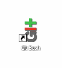

!SLIDE subsection

# The Complete Beginner's Guide to Programming

!SLIDE

# What is a program?

!SLIDE
# Operating Systems

<table>
  <tr>
    <td>
      
    <td>
      
    <td>
      
  </tr>
</table>

!SLIDE
# Applications

!SLIDE centereverything

# Web Application In Rails

!SLIDE incremental smbullets
# How do I write one?

* Learn about customer's requirements
* Translate to "stories"
* Pick a story that seems doable
* Write code that does it
* Show your work to the customer, get feedback
* Based on feedback, adjust your stories
* When a story is done, go back to "pick a story"
* Repeat until app is finished!

!SLIDE subsection

# Let's start writing code!

!SLIDE bullets
# "The Terminal"

* Windows: git bash 

* Mac OS X: Terminal 

* aka "The Shell" or "The Command Line" or "The Console" or "Bash" or "Shell"

!SLIDE commandline
# irb: the Interactive Ruby Browser

    $ irb

!SLIDE

## Variables
### words that hold information

    > my_variable = 5
    => 5
    > my_other_variable = "hi"
    => "hi"

* Setting a variable equal to something is called "assignment." In the above examples, we are assigning my_variable to 5 and my_other_variable to "hi."
* What types of information can we hold in a variable? (see next slide for answers)

!SLIDE
## Many types of information

* Strings
* Numbers
* Collections
* Dates
* Booleans (true/false)
* etc.

!SLIDE
## Strings (text)

* "This is a string."
* This is not a string.

### exercise
* Create variables called first_name, last_name, and favorite_color.
* Assign the variables to strings.
* Can you print out a sentence that reads "Hi, my name is (first name) (last name) and my favorite color is (favorite color)." with these variables? 
	* Hint: you can use a "+" to add strings together.

!SLIDE
## Numbers
* Numbers without decimal points are called **integers** and numbers with decimal points are called **floats**.
* Examples of integers:	
	* 0
	* -105
	* 898989898
	* 2
* Examples of floats:	
	* .0.0
	* -105.56
	* .33
	* .00004
* You can perform operations on both types of numbers with these characters: +, -, /, *
	
### exercises	
* Try dividing an integer by an integer. Try dividing an integer by a float. How are the results different? 
* Create two integer variables called num1 and num2 and assign them your favorite numbers.
* Next, compute the sum, difference, quotient, and product of these two numbers and assign these values to variables called sum, difference, quotient, and product, respectively.

!SLIDE
## Collections

* Arrays
 * In the following slides, we will cover the following topics:
	* Definition of an Array
	* Array indexing
	* Array methods

* Hashes
	* We will cover what a hash is and how you can use it.

!SLIDE
## Arrays

An Array is a list of objects.

    >> fruits = ["kiwi", "strawberry", "plum"]
    => ["kiwi", "strawberry", "plum"]

### exercises	
* Make your own array and name it grocery_list. 
* Include at least 5 items from your grocery list in the array.

!SLIDE
# Array Indexing

Ruby starts counting at zero.

    >> fruits[0]
    => "kiwi"
    >> fruits[2]
    => "plum"
    >> fruits[3]
    => nil

### exercises	
* Still have your grocery_list array? Good, because we're going to use it in this exercise.
* What is at index zero in your grocery_list array? How about index 5? Guess the answers and then use the syntax in the examples above (eg: fruits[0]) to see if your guesses were right. 

!SLIDE
# Array methods

* first, last
* push, pop
* shift, unshift

### exercises	
* Assign the first item in your grocery_list array to a variable named "first".
* Assign the last item in your grocery_list array to a variable named "last".
* Use the pop method to take the last item off of your grocery_list array.
* Has the value of your "last" variable changed? Why?
* Use the shift method to take off the first item in your grocery_list array.
* Has the value of your "first" variable changed? Why?
* Use the unshift and push methods to return your grocery_list array to its original state. 
 * Hint: it will look something like this: grocery_list.push("bananas")

!SLIDE
# Hashes

* aka Dictionary or Map
* collection of key/value pairs

        >> states = {"CA" => "California",
            "DE" => "Delaware"}
        => {"CA"=>"California", "DE"=>"Delaware"}

        >> states["CA"]
        => "California"

### exercises	
* When do you think you would use a hash vs an array?
* Define a Hash variable called my_info which has the following keys:
	* :first_name
	* :last_name
	* :hometown
	* :favorite_food

!SLIDE
## Operators

### doing stuff with variables

    > my_variable + 2
    => 7
    > my_variable * 3
    => 15
    > my_fruits = my_fruits + ["lychee"]
    => ["kiwi", "strawberry", "plum", "lychee"]
    > my_fruits = my_fruits - ["lychee"]
    => ["kiwi", "strawberry", "plum"]

* You can perform operations on variables and arrays the same way you perform operations on numbers.

### exercises

* Create an array called "vegetables" than contains 3 vegetables you like and 1 vegetable you don't like.
* Using the vegetables array, create an array called "my_vegetables" that contains only the vegetables you like.
* Extra: can you use the first two arrays to create a third array called "your_vegetables" that only contains the vegetable you don't like?

!SLIDE
## Methods

### things that do stuff.

* "If objects (like strings, integers, and floats) are the nouns in the Ruby language, then methods are like the verbs." - Chris Pine's "Learn to Program"
* Methods are called (used) with a "."  
 	* Example: 5.to_s (to_s is the method)
* As it turns out, 5 + 5 is really just a shortcut way of writing 5.+ 5.
* Each data type (string, integer, float) has a set of built in methods. You can see all of the string methods here: http://ruby-doc.org/core-1.9.3/String.html (there are tons - don't worry about memorizing them, just good to know where you can go to find out more)

### exercises
* Create a String variable called old_string and assign it the value "Ruby is cool"
* Use String methods to modify the old_string variable so that it is now "LOOC SI YBUR" and assign this to another variable called new_string.
 * Hint: look at the string methods "upcase" and "reverse"

!SLIDE
# Loops

### doing the same thing a bunch of times

The hard way:

    >> puts fruits[0]
    kiwi
    => nil
    >> puts fruits[1]
    strawberry
    => nil
    >> puts fruits[2]
    plum
    => nil

### exercises
* Create an array of 4 places you would like to visit.
* Print out each of these places.
	* Example: "I would like to visit " + places[0]

!SLIDE
# Loops

### doing the same thing a bunch of times

The easy way:

	>> fruits.each do |f|
	?>   puts f 
	>> end
	
    kiwi
    strawberry
    plum
    => ["kiwi", "strawberry", "plum"]

### exercises
* Still have that array of places you'd like to visit?
* Print out each of these places with a loop.
* Wasn't that better?

!SLIDE
## Conditionals

### doing something only if a condition is met

    >> fruits.each do |f|
    ?> puts f if f == "plum"
    >> end
    plum
    => ["kiwi", "strawberry", "plum"]

### exercises 
* Create an array called "class" that contains the names of some of the people in your Railsbridge class. Make sure you include your own name.
* Using your class array, create a conditional that prints "My Name is (your name)" for your name only. 

!SLIDE subsection
# Command-Line Programs

!SLIDE bullets
# Hello World

hello.rb:

    @@@ Ruby
    puts "Hello, World!"

!SLIDE bullets
# Arguments (ARGV)

hello.rb:

    @@@ Ruby
    puts "Hello, #{ARGV.first}!"

terminal:

    $ ruby hello.rb Alice
    Hello, Alice!

!SLIDE bullets
# Conditionals

hello.rb:

    @@@ Ruby
    if ARGV.empty?
      puts "Hello, World!"
    else
      puts "Hello, #{ARGV.first}!"
    end

terminal:

    $ ruby hello.rb
    Hello, World!
    $ ruby hello.rb Alice
    Hello, Alice!

!SLIDE
# Sinatra

hello_app.rb:

    @@@ Ruby
    require 'rubygems'
    require 'sinatra'

    get '/' do
      "<b>Hello, <i>bang bang</i>!"
    end

!SLIDE commandline
# Sinatra

    $ gem install sinatra
    $ ruby hello_app.rb
    == Sinatra/1.2.6 has taken the stage on 4567 for development with backup from Thin
    >> Thin web server (v1.2.7 codename No Hup)
    >> Maximum connections set to 1024
    >> Listening on 0.0.0.0:4567, CTRL+C to stop

then open a browser to <http://localhost:4567/>

!SLIDE bullets
# sinatra with rerun

    gem install rerun
    rerun hello_app.rb

...now it'll automatically reload when you edit a file.

!SLIDE
## Web App Network Architecture

!SLIDE
## Web App MVC Architecture

