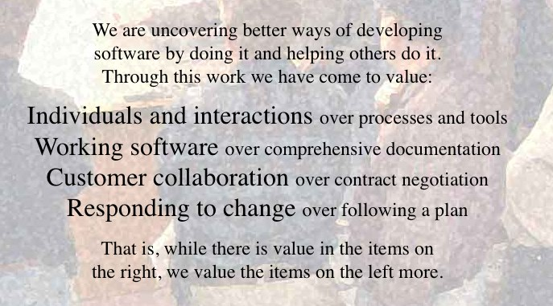

!SLIDE centereverything bullets

# Ruby on Rails Workshop

<!SLIDE bullets>

# Open source workshop

* It's a community project!
  * Many individuals
  * RailsBridge
  * DevChix

* All materials are open!
  * DevChix wiki, RailsBridge wiki
  * Slides: github, slidedown
  * See github.com/railsbridge

<!SLIDE bullets>
# Why are we here?
* Ruby on Rails!

<!SLIDE bullets>
# What is Ruby on Rails?

!SLIDE image
# Web Application Plumbing

!SLIDE center
# Ruby vs. Rails

|Ruby is a Language | Rails is a Framework |
|----|-----|
|  |  |

<!SLIDE bullets>
# Ruby: programming language

* Object oriented
* General purpose

<!SLIDE bullets>
# Rails: web application framework

* Database agnostic
* Built using the Ruby Language
* History
  * 37signals
  * 2004 - first released as open source
  * 2007 - shipped with Mac OS 10.5 "Leopard"

<!SLIDE bullets>
# The Rails Philosophy

* Opinionated
* Convention over configuration
* DRY (Don't Repeat Yourself)
  * less code means it's easier to maintain & modify
* Test Driven Development (TDD)
* Minimal code - maximal effect

<!SLIDE image>

<!SLIDE bullets>
# Agile development

* Pair programming
* Test-driven or Behavior-driven development

<!SLIDE bullets>
# Goal:
### &nbsp;
### By the end of the day, you will have built and deployed a web application - live on the internet!

<!SLIDE bullets>
# Don't be shy!
* Ask questions!
* TAs and teachers are here to

<!SLIDE bullets>
# Tools we'll be working with
* **rails**
* **rake**: like make for Ruby. An easy way to run tasks.
* **git**: source code control.
* **database**: we'll use SQLite, but could be any relational database.
* **editor**: KomodoEdit (?)
* **heroku**: free Rails hosting.

<!SLIDE bullets>
# Materials
* Slides: <http://curriculum.railsbridge.org/workshop>
* Suggestotron Curriculum: <http://curriculum.railsbridge.org/>

<!SLIDE bullets>
# Two Tracks Today
* Learn Ruby from the ground up
  * focus on learning to program
* Learn Rails (and Heroku and Github)
  * focus on tools and building web applications
  
---
Proceed to next slide deck: [Today's Workshop Info and Schedule](current)
